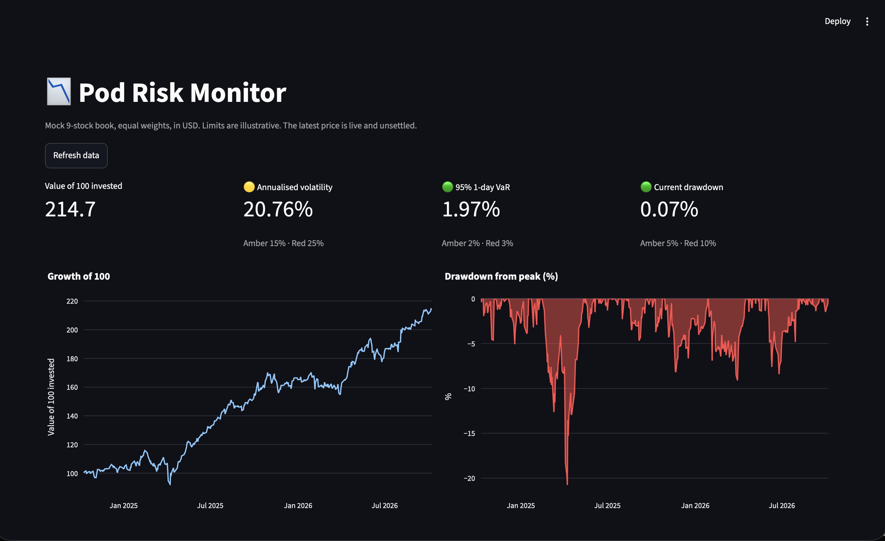

# Pod Risk Monitor

A risk dashboard for a mock nine-stock portfolio, built in Python. It pulls real market prices, converts everything to US dollars, and shows the numbers a multi-manager fund's risk team would watch: volatility, value at risk, drawdown, and which positions are driving the risk. Each number is checked against a limit and gets a traffic light.

I built it to learn how a portfolio manager thinks about risk, not only return.

**Live demo:** https://pod-risk-monitor.streamlit.app/

## What it found

The book holds nine stocks (AAPL, MSFT, NVDA, JPM, AMD, PLTR, PRU.L, SHEL.L, AZN.L), equally weighted, using two years of daily data. Figures below are a snapshot from 8 October 2026; the live app uses current prices, so its numbers move slightly.

| Measure | Result | Light |
| --- | --- | --- |
| Annualised volatility | 20.8% | Amber |
| 95% one-day VaR | 1.97% | Green, but only just |
| Max drawdown | 20.8%, low on 8 April 2025 | n/a |
| Current drawdown | Under 1%, the book was near a high | Green |

The main finding is concentration. PLTR, AMD and NVDA are a third of the capital but drive 67% of the book's volatility. The three London stocks are a third of the capital and contribute under a tenth of the risk. Holding nine tickers is not the same as holding nine independent bets.

## How it works

`main.py` is the engine and `app.py` is the dashboard.

- `load_prices` downloads daily closing prices from Yahoo Finance.
- `convert_to_usd` turns London prices from pence into pounds, then into dollars using the GBP/USD rate.
- `book_returns` calculates daily returns and combines them into one equal-weighted portfolio return.
- `risk_metrics` works out growth of 100, drawdown, volatility and VaR.
- `risk_contributions` splits the book's volatility into each position's share, so the shares add up to 100%.
- `status` compares a risk number with its amber and red limits and returns a colour.
- `print_report` and `plot_growth` give a Terminal report and a chart.
- `app.py` puts all of this on a Streamlit page and caches the data for 15 minutes.

## Assumptions and limitations

- Prices come from Yahoo Finance. The latest row is a live, unsettled price, so the numbers move slightly between runs.
- All positions are converted to US dollars.
- Weights are equal and reset to 1/9 each day. A real book would drift toward its winners.
- The tickers were chosen with hindsight, so the growth line is not a track record.
- VaR is the historical 5th percentile of daily returns. It says nothing about how bad the worst days can be.
- The limits are illustrative placeholders. Real limits come from a fund's mandate.

## How to run it

    python3 -m venv .venv
    source .venv/bin/activate
    pip install -r requirements.txt
    python3 -m streamlit run app.py
